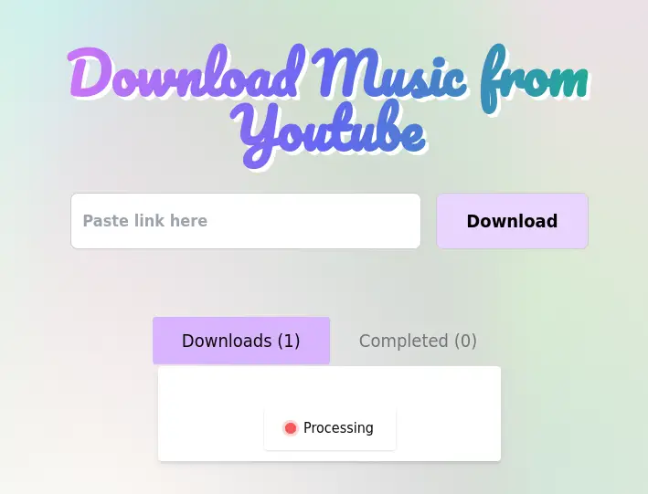
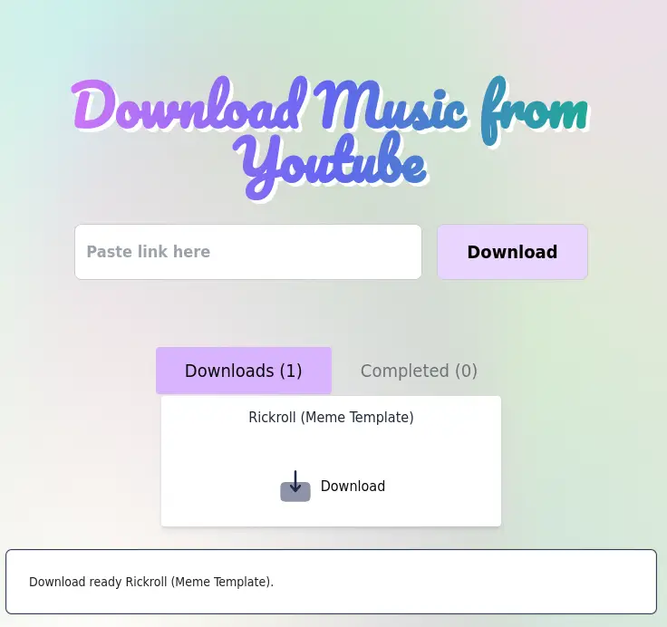

# YouTube Downloader Frontend

This is the frontend application for a YouTube video downloader, built with Nuxt 3.

The backend repository can be found here:
https://github.com/divagueame/ytdownloader-backend

## Features

- Download YouTube videos simultaneously
- Automatically convert videos to MP3 format
- User-friendly interface

## Prerequisites

- Docker
- Docker Compose

## Getting Started

1. Clone the repository:

`git clone https://github.com/divagueame/ytdownloader-frontend.git`
`cd ytdownloader-frontend`

2. Start the application using Docker Compose:

`docker-compose up`

3. Access the application at `http://localhost:8080`

## Docker image

`docker pull martinarceteixeira/ytdownloader-frontend`

## Screenshots

## License

This is an educational project. Everyone is free to use and modify this software without any warranty. The software is provided "as is", without warranty of any kind, express or implied, including but not limited to the warranties of merchantability, fitness for a particular purpose and noninfringement. In no event shall the authors or copyright holders be liable for any claim, damages or other liability, whether in an action of contract, tort or otherwise, arising from, out of or in connection with the software or the use or other dealings in the software.
